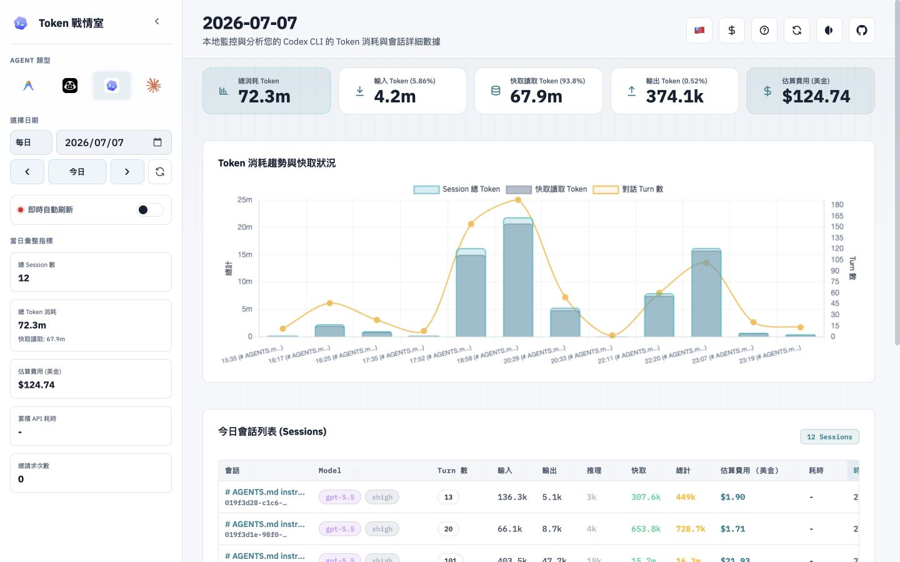
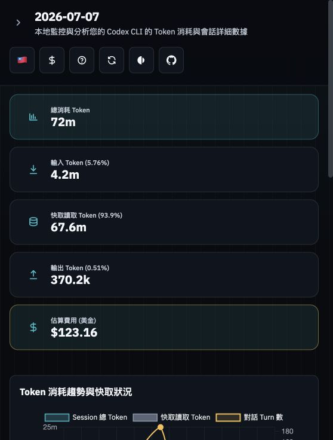

# Token 戰情室

**Token 戰情室是本地優先的 AI CLI 與 VS Code Copilot Token 使用量與會話還原看板。** 它會讀取本機上的 Google Antigravity CLI、GitHub Copilot CLI、GitHub Copilot Chat（VS Code）、Codex CLI 與 Claude Code 記錄，集中呈現每日、月度、年度的 Token 消耗、快取使用、推理 Token、估算費用、模型分佈、專案目錄分佈與完整 Session 時間軸。

本專案不會替你呼叫 AI 供應商 API 查詢資料；核心資料來源是本機日誌、Status Line 收集檔與本機 SQLite。

> 系統環境：支援 Windows 10/11 原生 PowerShell、macOS、Linux 與 WSL。

* * *

## 最短上手路徑

### 1. 一行安裝並啟動看板

Linux / macOS：

```bash
curl -fsSL https://raw.githubusercontent.com/doggy8088/TokenUsageInsights/main/scripts/get.sh | bash && "$HOME/.local/bin/token-usage-insights"
```

Windows PowerShell：

```powershell
irm https://raw.githubusercontent.com/doggy8088/TokenUsageInsights/main/scripts/get.ps1 | iex; & "$HOME\bin\token-usage-insights.cmd"
```

上述指令會下載與安裝目前平台的已編譯版本，不需要 Rust、Cargo、WSL 或手動解壓縮。安裝完成後，看板會在本機執行。

開啟：

```text
http://localhost:3003
```

### 2. 依你使用的 CLI 決定是否需要設定

| CLI | 是否需要額外設定 | 預設資料來源 | 說明 |
| --- | --- | --- | --- |
| Google Antigravity CLI | 需要 | `~/.gemini/antigravity-cli/usage/usage-YYYY-MM-DD.jsonl` | 透過 `statusline-token.sh` 或 Windows `statusline-token.ps1` 收集 Token 資料 |
| GitHub Copilot CLI | 需要 | `~/.copilot/usage/usage-YYYY-MM-DD.jsonl` | 透過 `statusline-token.sh` 或 Windows `statusline-token.ps1` 收集 Token 資料 |
| GitHub Copilot Chat（VS Code） | 不需要 | VS Code `workspaceStorage/chatSessions` | 看板直接掃描 VS Code Stable 與 Insiders 的本機聊天 Session |
| Codex CLI | 不需要 | `~/.codex/sessions` | 看板會直接掃描 Codex CLI 本機 Session 記錄 |
| Claude Code | 不需要 | `~/.claude/projects` | 看板會直接掃描 Claude Code 本機專案 Session 記錄 |

**只使用 VS Code Copilot、Codex CLI 或 Claude Code 時，執行一行安裝指令並開啟看板即可。**

### Windows 原生使用

Windows 的一行安裝會建立 `%USERPROFILE%\bin\token-usage-insights.cmd` 啟動檔；不需要 Rust MSVC toolchain、Visual Studio Build Tools、WSL、Git Bash 或 `jq`。

Windows 預設使用下列原生路徑：

| 用途 | Windows 預設路徑 |
| --- | --- |
| SQLite | `%LOCALAPPDATA%\TokenUsageInsights\token_usage_insights.db` |
| Antigravity | `%USERPROFILE%\.gemini\antigravity-cli` |
| Copilot | `%USERPROFILE%\.copilot` |
| Codex | `%USERPROFILE%\.codex` |
| Claude Code | `%USERPROFILE%\.claude` |
| Cursor | `%USERPROFILE%\.cursor` |

看板內的設定指南會在 Windows 顯示 PowerShell 複製、設定與診斷命令。PowerShell collector 使用 .NET JSON 與檔案 API，不依賴 Bash、`jq`、`sed` 或 `awk`。

磁碟機代號、含空白或非 ASCII 字元的路徑，以及 UNC 路徑都會交由原生路徑 API 處理。SQLite 資料庫仍建議放在本機磁碟，以避免網路分享的 locking 語意差異。

* * *

## 支援功能

### 資料分析

- 每日、月度、年度 Token 統計
- 輸入、輸出、快取讀取、快取寫入、推理 Token 分拆
- 依 `pricing.csv` 進行本地估算費用
- Session 數、請求次數與 API 耗時統計
- 模型使用量排名
- 專案工作目錄統計
- 可排序的 Session 清單

### Session 還原

- 右側抽屜式 Session 時間軸
- 使用者提示詞、助理回覆、推理內容與工具呼叫步驟
- 工具呼叫參數、退出碼、stdout、stderr
- Codex subagent 相關欄位，如 parent session、agent nickname、agent role
- Markdown 回覆渲染與內容清理

### 介面操作

- 四種 CLI 徽章切換
- 每日、月度、年度視圖
- 日期、月份、年份快速切換
- 5 秒、10 秒、30 秒即時自動刷新
- 手動同步本機日誌到 SQLite
- 深色與淺色主題
- 繁中與英文介面切換
- 模型費用表檢視

* * *

## Google Antigravity CLI 設定

Antigravity CLI 需要把本專案的 Status Line 腳本接到 `settings.json`。腳本會把每次對話後的 Token 累計與增量寫入：

```text
~/.gemini/antigravity-cli/usage/usage-YYYY-MM-DD.jsonl
```

### 1. 安裝收集腳本

完成一行安裝後，執行：

```bash
mkdir -p ~/.gemini/antigravity-cli && cp ~/.local/share/token-usage-insights/shell/antigravity/statusline-token.sh ~/.gemini/antigravity-cli/statusline-token.sh && chmod +x ~/.gemini/antigravity-cli/statusline-token.sh
```

若使用自訂安裝位置，請將指令中的 `~/.local/share/token-usage-insights` 替換為 `TOKEN_USAGE_INSIGHTS_INSTALL_DIR` 指定的位置。

### 2. 設定 `~/.gemini/antigravity-cli/settings.json`

若檔案不存在，可以建立以下內容。若檔案已存在，請只合併 `statusLine` 區塊，不要覆蓋原本設定。

```json
{
  "statusLine": {
    "type": "command",
    "command": "/ABSOLUTE/HOME/.gemini/antigravity-cli/statusline-token.sh",
    "padding": 1
  }
}
```

請將 `/ABSOLUTE/HOME` 替換成 `echo $HOME` 顯示的實際家目錄路徑，例如 `/Users/will` 或 `/home/will`。

### 3. 驗證

```bash
echo '{}' | ~/.gemini/antigravity-cli/statusline-token.sh
jq . ~/.gemini/antigravity-cli/settings.json
```

完成後重新進入 Antigravity CLI Session，狀態列會輸出類似格式：

```text
model-name • #3 • input 12.3k • cache 4.5k/0 • output 1.2k • reasoning 500 • total 18.5k
```

* * *

## GitHub Copilot CLI 設定

Copilot CLI 與 Antigravity CLI 一樣，需要把本專案的 Status Line 腳本接到 `settings.json`。腳本會把 Token 資料寫入：

```text
~/.copilot/usage/usage-YYYY-MM-DD.jsonl
```

### 1. 安裝收集腳本

完成一行安裝後，執行：

```bash
mkdir -p ~/.copilot && cp ~/.local/share/token-usage-insights/shell/copilot/statusline-token.sh ~/.copilot/statusline-token.sh && chmod +x ~/.copilot/statusline-token.sh
```

若使用自訂安裝位置，請將指令中的 `~/.local/share/token-usage-insights` 替換為 `TOKEN_USAGE_INSIGHTS_INSTALL_DIR` 指定的位置。

### 2. 設定 `~/.copilot/settings.json`

若檔案不存在，可以建立以下內容。若檔案已存在，請只合併 `statusLine` 區塊，不要覆蓋原本設定。

```json
{
  "statusLine": {
    "type": "command",
    "command": "/ABSOLUTE/HOME/.copilot/statusline-token.sh",
    "padding": 1
  }
}
```

請將 `/ABSOLUTE/HOME` 替換成 `echo $HOME` 顯示的實際家目錄路徑。

### 3. 驗證

```bash
echo '{}' | ~/.copilot/statusline-token.sh
jq . ~/.copilot/settings.json
```

完成後重新進入 Copilot CLI Session，狀態列會開始輸出並累積 Token 資料。

* * *

## GitHub Copilot Chat（VS Code）設定

**VS Code Copilot Chat 不需要安裝 Status Line、Hook 或額外收集腳本。**看板會直接讀取本機 `workspaceStorage` 內的聊天 Session，並與 Copilot CLI 合併顯示；Session 清單會以 `VS Code` 或 `CLI` 標示來源。

支援 VS Code Stable 與 Insiders：

| 平台 | Stable | Insiders |
| --- | --- | --- |
| Windows | `%APPDATA%\Code\User\workspaceStorage` | `%APPDATA%\Code - Insiders\User\workspaceStorage` |
| macOS | `~/Library/Application Support/Code/User/workspaceStorage` | `~/Library/Application Support/Code - Insiders/User/workspaceStorage` |
| Linux | `~/.config/Code/User/workspaceStorage` | `~/.config/Code - Insiders/User/workspaceStorage` |

使用方式：

1. 以 VS Code 使用 GitHub Copilot Chat 產生至少一個聊天 Session。
2. 啟動看板或按右上角同步按鈕。
3. 在 Copilot 頁面查看合併後的統計與 Session 時間軸。

看板會完整回填現有 `chatSessions` 檔案，也會在檔案大小或修改時間變更時重新同步；沒有 Token 欄位的聊天 Session 仍會顯示，但 Token 數為 0。資料只讀取本機聊天檔案，不包含雲端 Session、Remote SSH 主機或 `state.vscdb`。

若 VS Code 使用 `--user-data-dir` 或 Portable Mode，可指定看板自訂的資料根目錄：

macOS / Linux：

```bash
VSCODE_USER_DATA_DIR="/path/to/vscode-user-data" token-usage-insights
```

Windows PowerShell：

```powershell
$env:VSCODE_USER_DATA_DIR = "C:\path\to\vscode-user-data"; & "$HOME\bin\token-usage-insights.cmd"
```

`VSCODE_USER_DATA_DIR` 應指向包含 `User/workspaceStorage` 的 VS Code 使用者資料目錄。Portable Mode 若環境變數指向 `data` 目錄，請改用 `VSCODE_PORTABLE_DATA_DIR`；看板會同時檢查 `data/user-data/User/workspaceStorage` 與 `data/User/workspaceStorage`。

* * *

## Codex CLI 設定

**Codex CLI 不需要安裝 Hook、Status Line 或額外收集腳本。**

看板會直接掃描：

```text
~/.codex/sessions
```

使用方式：

1. 先正常使用 Codex CLI 產生至少一個 Session。
2. 啟動本專案。
3. 在左側選擇 Codex CLI。
4. 按右上角同步按鈕，或等待背景同步。

注意事項：

- Codex CLI 的身份憑證仍由 Codex CLI 自身管理。
- 看板只讀取本地 Session 記錄並做分析。
- API 額度資訊若有顯示，來源是最後一次本機 Session 日誌，不是即時線上查詢。

* * *

## Claude Code 設定

**Claude Code 不需要安裝 Hook、Status Line 或額外收集腳本。**

看板會直接掃描：

```text
~/.claude/projects
```

使用方式：

1. 先正常使用 Claude Code 產生至少一個專案 Session。
2. 啟動本專案。
3. 在左側選擇 Claude Code。
4. 按右上角同步按鈕，或等待背景同步。

注意事項：

- Claude Code 的身份憑證仍由 Claude Code 自身管理。
- 看板只讀取本地專案 Session 記錄並做分析。
- 若 `~/.claude/projects` 不存在，Claude Code 頁面會顯示無資料。

* * *

## 本地資料同步方式

啟動服務時，後端會初始化本機 SQLite 並立即同步一次資料。服務啟動後，也會每 5 秒背景同步一次。

SQLite 預設位置：

```text
~/.token-usage-insights/token_usage_insights.db
```

前端右上角的同步按鈕會呼叫：

```text
GET /api/:assistant/sync
```

這會觸發一次完整的本機日誌增量同步。

## 匯入 / 匯出（跨機器彙整）

**一般使用請直接使用看板右上角的匯出與匯入按鈕。** 安裝版只需要瀏覽器即可完成跨機器資料彙整，並支援最大 200 MB 的匯入檔案。

CLI 工具僅提供給從原始碼建置的進階使用者；Release 安裝包目前不包含 CLI 執行檔。

`--agent` 會指定助理（`antigravity` / `copilot` / `codex` / `claude` / `cursor`）

### 從原始碼使用 CLI

先建置一次：

```bash
cargo build --release --bin token-usage-insights-cli
```

```bash
# 匯出（輸出 JSON，含匯入唯一 id）
./target/release/token-usage-insights-cli export --agent codex --date 2026-07-09 --out daily-codex-2026-07-09.json
```

```bash
# 匯入（以匯入結果中的 date 或 `--date` 為準）
./target/release/token-usage-insights-cli import --agent codex --file daily-codex-2026-07-09.json
```

```bash
# 取得 CLI usage 說明
./target/release/token-usage-insights-cli --help
./target/release/token-usage-insights-cli export --help
./target/release/token-usage-insights-cli import --help
```

資料格式使用和前端一致，內含欄位：

- `version`
- `assistant`
- `date`
- `exported_at`
- `records`（每筆會有 `import_source_id`）

`import_source_id` 會與 `assistant_type` 一起做唯一鍵，重複匯入同一筆會被判為重複並自動跳過，不會重複寫入資料庫。

* * *

## 環境變數

環境變數指定的路徑會被視為權威設定，不必預先建立；`INSIGHTS_DIR` 會在啟動時自動建立。支援原生絕對/相對路徑，以及開頭為 `~`、`$HOME`、`%USERPROFILE%`、`%LOCALAPPDATA%` 或 `%APPDATA%` 的常見寫法。

| 變數 | 預設值 | 用途 |
| --- | --- | --- |
| `PORT` | `3003` | 看板服務埠號 |
| `INSIGHTS_DIR` | Windows: `%LOCALAPPDATA%\TokenUsageInsights`; 其他平台: `~/.token-usage-insights` | SQLite 資料庫目錄 |
| `ANTIGRAVITY_DIR` | `~/.gemini/antigravity-cli` | Antigravity CLI 資料目錄 |
| `COPILOT_DIR` | `~/.copilot` | Copilot CLI 資料目錄 |
| `VSCODE_USER_DATA_DIR` | 依平台自動偵測 | VS Code 使用者資料目錄，應包含 `User/workspaceStorage` |
| `VSCODE_PORTABLE_DATA_DIR` | 未設定 | VS Code Portable Mode 的 `data` 目錄 |
| `CODEX_DIR` | `~/.codex` | Codex CLI 資料目錄 |
| `CLAUDE_DIR` | `~/.claude` | Claude Code 資料目錄 |
| `CURSOR_DIR` | `~/.cursor` | Cursor 資料目錄 |
| `CORS_ALLOWED_ORIGINS` | `http://localhost:<PORT>,http://127.0.0.1:<PORT>` | 允許的 CORS 來源，逗號分隔 |

範例：

```bash
INSIGHTS_DIR="/tmp/token-usage-insights" PORT="3010" "$HOME/.local/bin/token-usage-insights"
```

Windows PowerShell 範例：

```powershell
$env:INSIGHTS_DIR = 'D:\Token Usage Insights\資料庫'; $env:CODEX_DIR = "$env:USERPROFILE\.codex"; $env:PORT = '3010'; & "$HOME\bin\token-usage-insights.cmd"
```

* * *

## 常駐服務

### Linux：一行安裝並啟用 systemd 使用者服務

```bash
curl -fsSL https://raw.githubusercontent.com/doggy8088/TokenUsageInsights/main/scripts/get.sh | bash -s -- --service
```

這會下載安裝版並立即啟用 `token-usage-insights.service`，不需要自行建置或修改 systemd 檔案。

### 管理服務

```bash
systemctl --user status token-usage-insights.service
journalctl --user -u token-usage-insights.service -n 50 -f
systemctl --user restart token-usage-insights.service
systemctl --user stop token-usage-insights.service
```

* * *

## 安裝選項與手動安裝

GitHub Release 提供 Linux、macOS 與 Windows 的已編譯可執行檔，安裝與執行都不需要 Rust 或 Cargo。

### 一行安裝的選用參數

`scripts/get.sh`（Linux / macOS）與 `scripts/get.ps1`（Windows）會自動判斷平台與 CPU 架構、從最新（或指定）Release 下載對應壓縮包、解壓後呼叫套件內的 `install.sh` / `install.ps1`，全程不需要手動下載或解壓：

Linux / macOS：

```bash
curl -fsSL https://raw.githubusercontent.com/doggy8088/TokenUsageInsights/main/scripts/get.sh | bash
```

Linux 如需同時安裝並啟用 systemd user service：

```bash
curl -fsSL https://raw.githubusercontent.com/doggy8088/TokenUsageInsights/main/scripts/get.sh | bash -s -- --service
```

Windows PowerShell：

```powershell
irm https://raw.githubusercontent.com/doggy8088/TokenUsageInsights/main/scripts/get.ps1 | iex
```

安裝完成後即可執行（Linux/macOS 需確認 `bin_dir` 已加入 `PATH`；Windows 會建立 `.cmd` shim）：

```bash
token-usage-insights
```

環境變數可控制版本與安裝路徑（皆為選用）：

| 變數 | 適用平台 | 說明 |
| --- | --- | --- |
| `TOKEN_USAGE_INSIGHTS_VERSION` | Linux / macOS / Windows | 指定要安裝的 Release tag，例如 `v0.2.0`。預設 `latest` |
| `TOKEN_USAGE_INSIGHTS_INSTALL_DIR` | Linux / macOS | 安裝目錄，會轉交給 `install.sh` |
| `TOKEN_USAGE_INSIGHTS_BIN_DIR` | Linux / macOS | 執行檔連結目錄，會轉交給 `install.sh` |

Windows 若要自訂安裝位置、bin 目錄與埠號，需先下載腳本再帶參數執行（`iex` 管線不支援傳參數）：

```powershell
Invoke-WebRequest -Uri https://raw.githubusercontent.com/doggy8088/TokenUsageInsights/main/scripts/get.ps1 -OutFile get.ps1
.\get.ps1 -InstallDir 'D:\Apps\Token Usage Insights' -Port 3010
```

### 手動下載安裝

若不想直接執行遠端腳本，也可以手動下載對應平台壓縮包並執行套件內建的安裝腳本。每個 Release 壓縮包都包含：

- 單一平台可執行檔
- `static/` 前端資產
- `pricing.csv` 模型費用表
- `shell/` 目錄下的 Status Line 與服務腳本
- `scripts/` 目錄（含 `install.sh`、`install.ps1`、`get.sh`、`get.ps1`）
- README、LICENSE 與 VERSION

Linux 或 macOS：

```bash
tar -xzf token-usage-insights-<tag>-<target>.tar.gz
cd token-usage-insights-<tag>-<target>
./install.sh
```

Linux 如需安裝並啟用 systemd user service：

```bash
./install.sh --service
```

Windows：

```powershell
Expand-Archive token-usage-insights-<tag>-x86_64-pc-windows-msvc.zip
cd token-usage-insights-<tag>-x86_64-pc-windows-msvc
powershell -ExecutionPolicy Bypass -File .\install.ps1
```

自訂 Windows 安裝位置與埠號：

```powershell
.\install.ps1 -InstallDir 'D:\Apps\Token Usage Insights' -BinDir "$HOME\bin" -Port 3010
```

### CI 驗證

`Release` workflow 每次建置都會在 Linux、macOS 與 Windows 上實際執行對應的安裝腳本（`install.sh` / `install.ps1`），安裝後啟動可執行檔並確認：

- 服務會在指定埠號回應 `/api/<assistant>/pricing`
- 回應內容確實載入了套件內的 `pricing.csv`
- 全新的 `INSIGHTS_DIR` 會被建立並產生 SQLite 資料庫

`get.sh` 與 `get.ps1` 也會在每次建置時先做語法檢查（`bash -n` 與 PowerShell AST 剖析），確保推送到 Release 的版本可以正常執行。

### 維護者發行

推送 Git tag 後，GitHub Actions 會自動建立對應 Release：

```bash
git tag vX.Y.Z
git push origin vX.Y.Z
```

* * *

## 舊資料遷移

若你以前使用過下列獨立專案，啟動本專案時會自動嘗試遷移舊 SQLite 資料：

- `~/.gemini/antigravity-cli/antigravity_cli_token_insights.db`
- `~/.copilot/copilot_cli_token_insights.db`
- `~/.codex/codex_cli_token_insights.db`

遷移成功後，舊資料庫會被改名為 `.bak`。

若你已確認資料遷移完成，可以停用舊服務：

```bash
systemctl --user stop copilot-cli-token-insights.service
systemctl --user disable copilot-cli-token-insights.service
systemctl --user stop antigravity-cli-token-insights.service
systemctl --user disable antigravity-cli-token-insights.service
systemctl --user stop codex-cli-token-insights.service
systemctl --user disable codex-cli-token-insights.service

rm -f ~/.config/systemd/user/copilot-cli-token-insights.service
rm -f ~/.config/systemd/user/antigravity-cli-token-insights.service
rm -f ~/.config/systemd/user/codex-cli-token-insights.service

systemctl --user daemon-reload
systemctl --user reset-failed
```

* * *

## 疑難排查

### 看板沒有資料

依 CLI 檢查資料來源是否存在：

```bash
ls ~/.gemini/antigravity-cli/usage
ls ~/.copilot/usage
ls ~/.codex/sessions
ls ~/.claude/projects
```

Antigravity CLI 與 Copilot CLI 還需要確認 `settings.json` 已設定 `statusLine`，且腳本具備執行權限。

Windows PowerShell 可直接檢查原生資料目錄：

```powershell
Get-ChildItem "$env:USERPROFILE\.gemini\antigravity-cli\usage"
Get-ChildItem "$env:USERPROFILE\.copilot\usage"
Get-ChildItem "$env:USERPROFILE\.codex\sessions"
Get-ChildItem "$env:USERPROFILE\.claude\projects"
```

### Status Line 腳本無法執行

```bash
command -v jq
chmod +x ~/.gemini/antigravity-cli/statusline-token.sh
chmod +x ~/.copilot/statusline-token.sh
```

Status Line 腳本依賴 `jq` 解析 CLI 傳入的 JSON。

上述 `jq` 需求只適用於 `.sh` collector。Windows `.ps1` collector 可用下列命令測試，並會原生處理反斜線與含空白路徑：

```powershell
Write-Output '{}' | powershell.exe -NoProfile -ExecutionPolicy Bypass -File "$env:USERPROFILE\.gemini\antigravity-cli\statusline-token.ps1" -Assistant antigravity
```

### 設定檔 JSON 格式錯誤

```bash
jq . ~/.gemini/antigravity-cli/settings.json
jq . ~/.copilot/settings.json
```

若已經有其他設定，請合併 `statusLine` 物件，不要把整個檔案替換成陣列或純字串。

### 連不上 `localhost:3003`

```bash
PORT=3010 "$HOME/.local/bin/token-usage-insights"
```

若改用其他埠號，請開啟對應網址，例如：

```text
http://localhost:3010
```

* * *

## 開發指令

本節僅供需要修改或從原始碼建置專案的開發者使用；一般使用請採用前述一行安裝指令。

```bash
git clone https://github.com/doggy8088/TokenUsageInsights.git
cd TokenUsageInsights
cargo fmt
cargo test
cargo clippy --all-targets --all-features
cargo build --release
./target/release/token-usage-insights
```

* * *

## 專案檔案

```text
src/                 Rust 後端、API、SQLite 同步、價格與時間軸解析
static/              前端 HTML、JavaScript、CSS 與圖片資產
shell/               Bash/PowerShell Status Line collector 與 systemd 服務範本
scripts/             Linux/macOS、Windows 安裝與 Windows smoke test
pricing.csv          模型價格表，本地估算費用依此檔案載入
```

* * *

## 畫面展示






